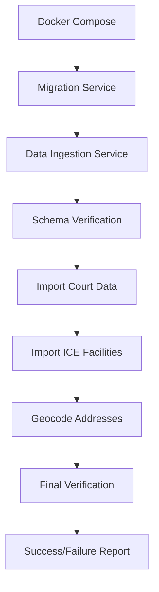

# Data Ingestion Documentation

## Overview

This document provides comprehensive documentation for the Habeas data ingestion system, which imports court data and ICE detention facility information into the PostgreSQL database through a structured Docker-based pipeline.

## Project Context

- **Project**: Habeas - React Native/FastAPI application for connecting detained individuals with legal representatives
- **Phase**: Beta development
- **Documentation Version**: 1.2
- **Last Updated**: December 2024

## Architecture Overview

The data ingestion system follows a structured pipeline approach:

```
data/pipeline/
├── 2_staging_data/          # CSV and Excel source files
├── 3_ingestion_scripts/     # Python scripts to import data
├── 4_verification/          # Scripts to verify successful import
└── run_data_ingestion.py    # Main orchestrator script
```

### Key Components

1. **Docker Service**: `data-ingestion` service in `apps/docker-compose.yml`
2. **Main Runner**: `data/pipeline/run_data_ingestion.py` - orchestrates the entire process
3. **Ingestion Scripts**:
   - `import_court_data.py` - Imports court data, counties, and contact information
   - `import_ice_facilities.py` - Imports ICE detention facilities and geocodes addresses
4. **Verification**: `verify_migration.py` - Validates schema and data completeness

## Docker Integration

The data ingestion system is fully integrated into the Docker Compose workflow:

- **Service**: `data-ingestion` runs after `migration` service completes
- **Dependencies**: Proper dependency chain: `db` → `migration` → `data-ingestion`
- **Health Checks**: PostgreSQL health checks ensure database readiness
- **Volume Mapping**: Maps `../data:/app/data` for access to staging files

### Running Data Ingestion

#### Full Integration Test

```bash
# Clean state (recommended for testing)
docker compose -f apps/docker-compose.yml down -v

# Run complete data ingestion pipeline
docker compose -f apps/docker-compose.yml up data-ingestion
```

#### Individual Script Testing

```bash
# Test court data import only
docker compose -f apps/docker-compose.yml run --rm data-ingestion python /app/data/pipeline/3_ingestion_scripts/import_court_data.py

# Test ICE facilities basic data only
docker compose -f apps/docker-compose.yml run --rm -e SKIP_API_CALLS=true data-ingestion python /app/data/pipeline/3_ingestion_scripts/import_ice_facilities.py
```

## Data Pipeline Structure

The pipeline operates in two distinct phases:

### Phase 1: Basic Data Loading (No API Calls)
- Sets `SKIP_API_CALLS=true` environment variable
- Imports court data and ICE facilities basic information
- Verifies basic data with `basic_data` verification mode
- **Expected Results**:
  - Courts table: ~91 records
  - Court counties table: ~2945 records
  - District court contacts table: ~258 records
  - ICE facilities table: ~142 records (basic data only)

### Phase 2: API-Dependent Operations
- Only runs if Phase 1 succeeds
- Only runs if `POSITIONSTACK_KEY` is available
- Performs geocoding and court mapping operations
- **Expected Results**:
  - Normalized addresses table: Records based on API success
  - ICE facilities with court mappings where geocoding succeeded

## ICE Detention Facilities Geocoding Workflow

### Overview

The geocoding system provides comprehensive location data for ICE detention facilities using a dual-API approach:

1. **Primary geocoding script** using Nominatim (OpenStreetMap) with Positionstack API fallback
2. **CSV-based import script** that can use pre-geocoded data to avoid API calls
3. **Dual geocoding approach** for maximum coverage and reliability

### Geocoding Strategy

#### Dual API Approach
- **Primary**: Nominatim (OpenStreetMap) - Free, no API key required
- **Fallback**: Positionstack API - Commercial service for better coverage
- **Result**: Maximum geocoding success rate

#### Pre-geocoded Data Reuse
- Geocoded data is saved to a separate CSV file
- Import script can use pre-geocoded data to avoid repeated API calls
- Reduces API usage and improves import speed

### File Structure

```
data/
├── static_assets/
│   ├── 2025_ice_detention_facilities.csv          # Main facility data
│   ├── 2025_ice_detention_facilities_geocoded.csv # Geocoded facility data
│   └── 2025_ice_detention_facilities.xlsx         # Original Excel file (legacy)
└── pipeline/
    └── 3_ingestion_scripts/
        ├── geocode_csv_facilities.py               # Geocoding script
        ├── import_ice_facilities_csv.py            # CSV import script
        ├── import_ice_facilities.py                # Excel import script (legacy)
        └── geocode_ice_facilities.py               # Database geocoding script (legacy)
```

### Usage Instructions

#### 1. Geocode Facilities (One-time or when data changes)

```bash
cd apps/backend
uv run --extra data-import python ../../data/pipeline/3_ingestion_scripts/geocode_csv_facilities.py
```

**Environment Variables:**
- `POSITIONSTACK_KEY` (optional) - For fallback geocoding

#### 2. Import Facilities to Database

```bash
cd apps/backend
uv run --extra data-import python ../../data/pipeline/3_ingestion_scripts/import_ice_facilities_csv.py
```

**Environment Variables:**
- `POSITIONSTACK_KEY` (optional) - For additional geocoding of remaining facilities
- `SKIP_API_CALLS=true` (optional) - Skip API calls entirely

## Database Schema Integration

### Models
- Proper SQLAlchemy models for all data entities
- Foreign key relationships between courts, counties, and contacts

### Migrations
- Alembic migrations for schema management
- Column length fixes for data compatibility

### Key Schema Fixes

#### Location Name Length Fix
**Issue**: Court contacts import failed due to 50-character limit on `location_name` column
**Solution**: Migration `fix_location_name_length` increases column to 255 characters

#### Phone Number Length Fix
**Issue**: Phone number truncation in district_court_contacts table
**Solution**: Migration updates phone column from varchar(50) to varchar(255)

## Issues and Resolutions

### ✅ Resolved Issues

#### 1. Docker Configuration Issues
**Problem**: Initial `docker compose up data-ingestion` failed with configuration errors
**Solution**:
- Used correct path: `docker compose -f apps/docker-compose.yml up data-ingestion`
- Properly configured service with dependencies and volume mappings

#### 2. Database Type Mismatch
**Problem**: `psycopg2.errors.InvalidTextRepresentation` when inserting address strings
**Solution**:
- Cleared Docker volumes to ensure clean database state
- Added proper health checks to ensure migrations complete before ingestion
- Implemented explicit string casting in import scripts

#### 3. Missing Dependencies
**Problem**: `import_ice_facilities.py` failed due to missing `openpyxl` dependency
**Solution**: Added `openpyxl>=0.1.0` to `apps/backend/pyproject.toml` under `data-import` dependencies

#### 4. ICE Facilities Data Processing
**Problem**: All 148 ICE facility rows were skipped due to "missing facility name" warnings
**Solution**:
- Fixed header parsing with `header=6` parameter
- Corrected column name mapping to "Name"
- Now successfully imports 142/148 facilities

#### 5. Database Column Length Issues
**Problem**: String truncation errors in district_court_contacts table
**Solution**:
- Updated phone_length_fix migration to actually alter phone column from varchar(50) to varchar(255)
- Fixed location_name field length with dedicated migration

### ⚠️ Ongoing Considerations

#### API Rate Limiting
**Issue**: PositionStack geocoding API rate limits (429 errors) prevent complete address normalization
**Current Status**: Partial geocoding success with 1-second delays
**Mitigation Strategies**:
- Implemented 1-second delay between API calls
- Added error handling for rate limit responses
- Process continues with partial data

## Verification and Testing

### Verification Script

The verification script (`verify_migration.py`) supports multiple modes:

- `schema_only`: Only checks table existence
- `basic_data`: Requires courts, court_counties, district_court_contacts
- `full_check`: Requires all tables including ice_detention_facilities

### Verification Commands

#### Check Database Schema
```bash
# Check location_name column length
docker compose -f apps/docker-compose.yml exec db psql -U postgres -d habeas -c "SELECT column_name, data_type, character_maximum_length FROM information_schema.columns WHERE table_name = 'district_court_contacts' AND column_name = 'location_name';"
```

#### Check Data Counts
```bash
# Check all table counts
docker compose -f apps/docker-compose.yml exec db psql -U postgres -d habeas -c "
SELECT
  'courts' as table_name, COUNT(*) as row_count FROM courts
UNION ALL
SELECT 'court_counties', COUNT(*) FROM court_counties
UNION ALL
SELECT 'district_court_contacts', COUNT(*) FROM district_court_contacts
UNION ALL
SELECT 'ice_detention_facilities', COUNT(*) FROM ice_detention_facilities
UNION ALL
SELECT 'normalized_addresses', COUNT(*) FROM normalized_addresses;
"
```

### Expected Results

After successful data ingestion:
- **91 courts** imported successfully
- **2945 court-county associations** imported
- **258 district court contacts** imported
- **141 ICE detention facilities** imported
- **Verification status**: SUCCESS - all critical tables populated

## Technical Notes

### Rate Limiting
- Nominatim: 1 request per second (built into script)
- Positionstack: Varies by plan (free plan has low limits)

### Data Quality
- Nominatim provides very detailed normalized addresses
- Some addresses may fail geocoding due to incomplete or non-standard formatting
- Military addresses (FPO) and some rural addresses may not geocode successfully

### Error Recovery
- Script continues processing even if individual facilities fail
- All errors are logged with timestamps
- Failed facilities can be manually reviewed and corrected

## Data Flow



## Success Metrics

✅ **Docker Integration**: Complete workflow from migration to verification
✅ **Court Data**: Courts and court-county associations import correctly
✅ **ICE Facilities**: Raw facility data imports successfully (142/148 records)
✅ **Geocoding System**: Dual API approach with fallback mechanisms
✅ **Error Handling**: Robust error handling and logging throughout pipeline
✅ **Verification**: Comprehensive verification script with multiple modes
✅ **Schema Fixes**: All column length issues resolved
✅ **CSV Workflow**: Pre-geocoded data reuse to avoid repeated API calls

## Files Modified/Created

### New Files Created
1. `data/pipeline/3_ingestion_scripts/geocode_csv_facilities.py` - Primary geocoding script
2. `data/pipeline/3_ingestion_scripts/import_ice_facilities_csv.py` - CSV import script
3. `data/pipeline/3_ingestion_scripts/geocode_ice_facilities.py` - API operations script
4. `data/static_assets/2025_ice_detention_facilities_geocoded.csv` - Geocoded facility data
5. `apps/backend/migrations/versions/fix_location_name_length.py` - Schema fix migration

### Modified Files
1. `data/pipeline/run_data_ingestion.py` - Main orchestrator with phases
2. `data/pipeline/3_ingestion_scripts/import_ice_facilities.py` - Basic data import
3. `data/pipeline/4_verification/verify_migration.py` - Enhanced verification modes
4. `apps/backend/pyproject.toml` - Added geopy and openpyxl dependencies

## Next Steps

1. **Monitor API Usage**: Track geocoding API usage and optimize for cost/coverage
2. **Data Quality**: Review and improve geocoding success rates
3. **Automation**: Consider adding geocoding to CI/CD pipeline for data updates
4. **Documentation**: Keep this documentation updated as the system evolves

---

The data ingestion system provides a robust foundation for importing and managing court and detention facility data in the Habeas application, with comprehensive error handling, verification, and documentation.
